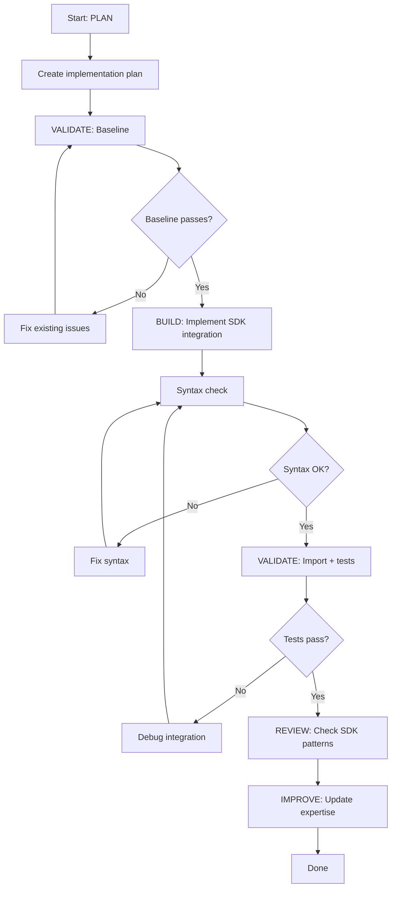

# Claude SDK Expert - Plan Build Improve Workflow

> Full ACT-LEARN-REUSE workflow for SDK development.

## Purpose

Execute the complete SDK development workflow:
1. **PLAN** - Design SDK integration using expertise
2. **VALIDATE (baseline)** - Verify SDK is importable and tests pass
3. **BUILD** - Implement the integration
4. **VALIDATE (post)** - Verify no regressions
5. **REVIEW** - Check SDK patterns and best practices
6. **IMPROVE** - Update expertise with learnings

## Usage

```
/experts:claude-sdk:plan_build_improve [feature description or SDK integration]
```

## Variables

- `TASK`: $ARGUMENTS

## Allowed Tools

`Read`, `Write`, `Edit`, `Bash`, `Grep`, `Glob`

---

## Workflow

### Step 1: PLAN (Context Loading)

1. Read `.claude/commands/experts/claude-sdk/expertise.md` for:
   - `query()` API patterns
   - Session management lifecycle
   - Subagent orchestration patterns
   - Custom tool and MCP setup
   - Hook system
   - Known issues

2. Analyze the TASK:
   - Search codebase for relevant SDK usage
   - Identify which SDK features are needed
   - Determine ClaudeAgentOptions configuration

3. Create implementation plan:
   - Write to `.claude/specs/claude-sdk-{feature}.md`
   - Include SDK feature checklist
   - Include validation strategy

---

### Step 2: VALIDATE (Baseline)

1. Run pre-change validation:
   ```bash
   # Verify SDK is importable
   python -c "from claude_agent_sdk import query, ClaudeAgentOptions; print('SDK import OK')"

   # Check SDK version
   python -c "import claude_agent_sdk; print(f'Version: {claude_agent_sdk.__version__}')" 2>/dev/null || echo "No __version__ attr"

   # Verify existing test files compile
   python -c "import py_compile; py_compile.compile('server/tests/test_eagle_sdk_eval.py', doraise=True)"
   python -c "import py_compile; py_compile.compile('server/tests/test_agent_sdk.py', doraise=True)"
   ```

2. If SDK tests exist for the affected area, run them:
   ```bash
   python server/tests/test_eagle_sdk_eval.py --model haiku --tests 1,2,3,4,5,6
   ```

3. **STOP if baseline fails** - Fix existing issues first

---

### Step 3: BUILD (Implement Changes)

1. Implement SDK integration following proven patterns:
   - Use `ClaudeAgentOptions` for all configuration
   - Process messages from `query()` async generator
   - Extract `session_id` from SystemMessage or ResultMessage
   - Track cost via `ResultMessage.usage` and `total_cost_usd`
   - Handle `ExceptionGroup` for MCP server cleanup on Windows

2. Follow multi-tenant patterns:
   - Inject tenant context via `system_prompt`
   - Gate tools via `allowed_tools` per tier
   - Set `max_budget_usd` per tier
   - Always re-provide `system_prompt` on session resume

3. Keep changes atomic and focused

---

### Step 4: VALIDATE (Post-Implementation)

1. Run post-change validation:
   ```bash
   # Syntax check new/modified files
   python -c "import py_compile; py_compile.compile('server/tests/test_eagle_sdk_eval.py', doraise=True)"

   # Import check
   python -c "from claude_agent_sdk import query, ClaudeAgentOptions; print('OK')"

   # Run affected tests
   python server/tests/test_eagle_sdk_eval.py --model haiku --tests 1,2,3,4,5,6
   ```

2. Compare to baseline:
   - All baseline tests still pass?
   - New functionality works?
   - No import errors or type issues?

3. If validation passes: proceed to review
4. If validation fails: fix and re-run

---

### Step 5: REVIEW

1. Review SDK usage:
   - Does the integration follow proven `query()` patterns?
   - Is `ClaudeAgentOptions` configured correctly?
   - Are all message types handled (System, Assistant, Result)?
   - Is cost tracked via `ResultMessage.usage`?

2. Check for:
   - `system_prompt` includes tenant context
   - `max_budget_usd` is set
   - `permission_mode` is appropriate
   - MCP tool names follow `mcp__{server}__{tool}` convention
   - Session resume re-provides `system_prompt`
   - Error handling for `ExceptionGroup` (Windows MCP cleanup)

---

### Step 6: IMPROVE (Self-Improve)

1. Determine outcome:
   - **success**: All validations pass
   - **partial**: Some checks pass
   - **failed**: Validation fails

2. Update `.claude/commands/experts/claude-sdk/expertise.md`:
   - Add to `patterns_that_work`
   - Add to `patterns_to_avoid`
   - Document any `common_issues`
   - Add helpful `tips`

3. Update `last_updated` timestamp

---

## Decision Points



---

## Report Format

```markdown
## SDK Integration Complete: {TASK}

### Summary

| Phase | Status | Notes |
|-------|--------|-------|
| Plan | DONE | .claude/specs/claude-sdk-{feature}.md |
| Baseline | PASS | SDK importable, {N} tests pass |
| Build | DONE | {description of integration} |
| Validation | PASS | No regressions |
| Review | PASS | Follows SDK patterns |
| Improve | DONE | Expertise updated |

### SDK Features Used

- [ ] query() async generator
- [ ] ClaudeAgentOptions
- [ ] Session resume
- [ ] Subagents (AgentDefinition)
- [ ] Custom tools (@tool + MCP)
- [ ] Hooks (HookMatcher)
- [ ] TraceCollector pattern

### Learnings Captured

- Pattern: {what worked}
- Tip: {useful observation}
```

---

## Instructions

1. **Follow the workflow order** - Don't skip validation steps
2. **Stop on failures** - Fix before proceeding
3. **Keep atomic** - One SDK integration per workflow
4. **Always improve** - Even failed attempts have learnings
5. **Check cost** - Verify max_budget_usd is appropriate
6. **Test with haiku** - Use haiku model for cost-effective testing
