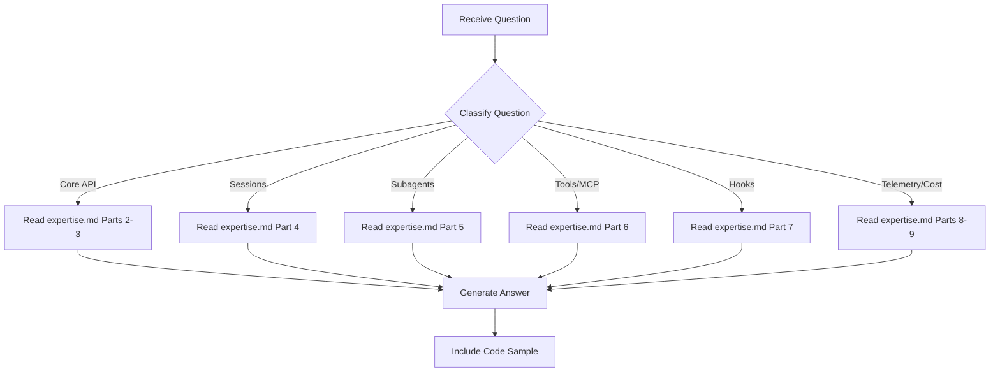

# Claude SDK Expert - Question Mode

> Read-only command to query SDK knowledge without making any changes.

## Purpose

Answer questions about the Claude Agent SDK — `query()` API, sessions, subagents, custom tools/MCP, hooks, telemetry, cost tracking — **without making any code changes**.

## Usage

```
/experts:claude-sdk:question [question]
```

## Allowed Tools

`Read`, `Glob`, `Grep`, `Bash` (read-only commands only)

## Question Categories

### Category 1: Core API Questions

Questions about `query()`, `ClaudeAgentOptions`, message types.

**Examples**:
- "How do I call query() with a system prompt?"
- "What fields does ClaudeAgentOptions support?"
- "What message types does query() yield?"

**Resolution**:
1. Read `.claude/commands/experts/claude-sdk/expertise.md` -> Parts 2-3
2. If needed, read `server/tests/test_eagle_sdk_eval.py` for working examples
3. Provide formatted answer with code sample

---

### Category 2: Session Questions

Questions about session creation, resume, and multi-turn patterns.

**Examples**:
- "How do I get the session_id?"
- "How does session resume work?"
- "Is system_prompt preserved across resume?"

**Resolution**:
1. Read `.claude/commands/experts/claude-sdk/expertise.md` -> Part 4
2. If needed, read `server/tests/test_eagle_sdk_eval.py` tests 1-2
3. Provide answer with session lifecycle details

---

### Category 3: Subagent Questions

Questions about `AgentDefinition`, orchestration, and parent tracking.

**Examples**:
- "How do I define a subagent?"
- "How does parent_tool_use_id work?"
- "Can subagents use different models?"

**Resolution**:
1. Read `.claude/commands/experts/claude-sdk/expertise.md` -> Part 5
2. If needed, read `server/tests/test_eagle_sdk_eval.py` test 4 or `server/tests/test_agent_sdk.py` test 1
3. Provide answer with AgentDefinition examples

---

### Category 4: Tools & MCP Questions

Questions about `@tool` decorator, `create_sdk_mcp_server()`, tool naming.

**Examples**:
- "How do I create a custom tool?"
- "What's the MCP tool naming convention?"
- "How do I register tools in allowed_tools?"

**Resolution**:
1. Read `.claude/commands/experts/claude-sdk/expertise.md` -> Part 6
2. If needed, read `server/tests/test_agent_sdk.py` lines 42-68
3. Provide answer with decorator pattern and MCP server setup

---

### Category 5: Hook Questions

Questions about `HookMatcher`, hook event types, callback signatures.

**Examples**:
- "What hook events are available?"
- "How do I intercept tool calls with PreToolUse?"
- "What does the hook callback return?"

**Resolution**:
1. Read `.claude/commands/experts/claude-sdk/expertise.md` -> Part 7
2. If needed, read `server/tests/test_agent_sdk.py` for hook examples
3. Provide answer with HookMatcher registration pattern

---

### Category 6: Telemetry & Cost Questions

Questions about TraceCollector, message processing, token accounting.

**Examples**:
- "How do I track tokens and cost?"
- "What's in ResultMessage.usage?"
- "How does TraceCollector work?"

**Resolution**:
1. Read `.claude/commands/experts/claude-sdk/expertise.md` -> Parts 8-9
2. If needed, read `server/tests/test_eagle_sdk_eval.py` TraceCollector class
3. Provide answer with usage extraction pattern

---

## Workflow



---

## Report Format

```markdown
## Answer

{Direct answer to the question}

## Details

{Supporting information from expertise.md or source files}

## Code Sample

{Copy-pasteable code from actual project usage}

## Source

- expertise.md -> {section}
- server/tests/{file}:{line} (if referenced)
```

---

## Instructions

1. **Read expertise.md first** - All knowledge is stored there
2. **Never modify files** - This is a read-only command
3. **Include code samples** - SDK answers are most useful with working code
4. **Be specific** - Reference exact parts, sections, and line numbers
5. **Suggest next steps** - If appropriate, suggest what command to run next
