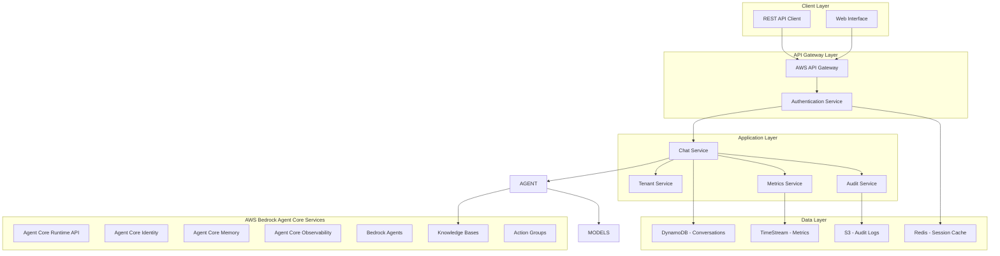
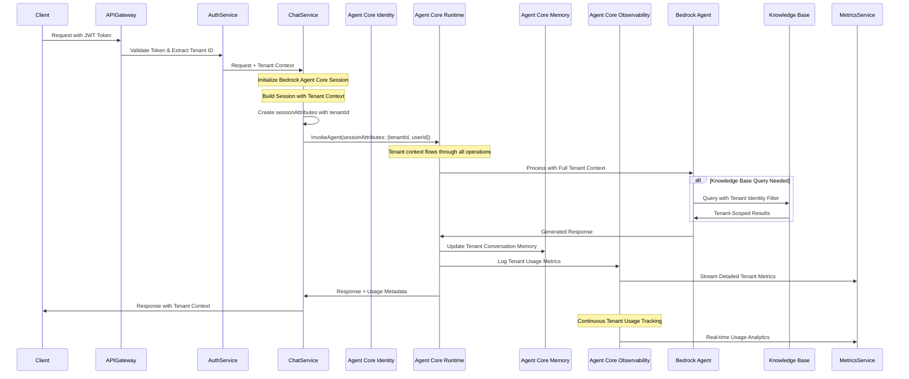

# Design Document

## Overview

The multi-tenant chatbot application is designed as a cloud-native solution leveraging AWS Bedrock Agent services with comprehensive tenant ID propagation and usage tracking. The architecture follows a microservices pattern with clear separation of concerns, ensuring scalability, security, and maintainability. The system implements tenant isolation at multiple layers while providing rich analytics and monitoring capabilities.

## Architecture

### High-Level Architecture



### Tenant ID Propagation Flow with Bedrock Agent Core Services



## Components and Interfaces

### 1. Authentication Service

**Purpose:** Handles tenant authentication and JWT token management

**Key Interfaces:**
- `POST /auth/login` - Tenant user authentication
- `POST /auth/refresh` - Token refresh
- `GET /auth/validate` - Token validation with tenant extraction

**Implementation Details:**
- JWT tokens contain tenant ID in claims
- Integration with AWS Cognito for user management
- Tenant-specific user pools for complete isolation
- Session management with Redis for performance

### 2. Chat Service

**Purpose:** Core chatbot functionality with tenant-aware conversation management

**Key Interfaces:**
- `POST /chat/conversations` - Start new conversation
- `POST /chat/conversations/{id}/messages` - Send message
- `GET /chat/conversations/{id}` - Retrieve conversation history
- `GET /chat/conversations` - List tenant conversations

**Implementation Details:**
- Tenant ID propagated through all operations
- Integration with AWS Bedrock Agent Runtime API
- Conversation state management per tenant
- Message preprocessing and postprocessing hooks

### 3. Tenant Service

**Purpose:** Manages tenant configuration and metadata

**Key Interfaces:**
- `GET /tenants/{id}` - Get tenant configuration
- `PUT /tenants/{id}/config` - Update tenant settings
- `GET /tenants/{id}/agents` - List available agents for tenant

**Implementation Details:**
- Tenant-specific agent configurations
- Custom knowledge base mappings per tenant
- Feature flags and usage limits per tenant
- Tenant onboarding and provisioning workflows

### 4. Metrics Service

**Purpose:** Collects, aggregates, and serves usage metrics per tenant

**Key Interfaces:**
- `POST /metrics/events` - Record usage events
- `GET /metrics/tenants/{id}/usage` - Get tenant usage statistics
- `GET /metrics/tenants/{id}/dashboard` - Dashboard data
- `GET /metrics/tenants/{id}/export` - Export usage data

**Implementation Details:**
- Real-time metrics ingestion using AWS Kinesis
- Time-series data storage in Amazon TimeStream
- Pre-aggregated metrics for dashboard performance
- Configurable retention policies per metric type

### 5. AWS Bedrock Agent Core Services Integration

**Purpose:** Leverages AWS Bedrock Agent Core services with comprehensive tenant identity and usage tracking

**Core Services for Multi-Tenant Solution:**

1. **Amazon Bedrock Agent Core Runtime API** (Essential)
   - Primary service for agent invocations
   - Session attributes to pass tenant ID: `sessionAttributes: { "tenantId": "tenant-123" }`
   - All agent interactions flow through this API
   - Returns usage metadata that can be tagged with tenant ID

2. **Amazon Bedrock Agent Core Observability** (Essential for Usage Tracking)
   - **Primary source for tenant usage metrics**
   - Captures detailed metrics for each tenant's agent interactions
   - Provides token usage, latency, and performance data per tenant
   - Real-time monitoring and analytics per tenant
   - **This is where you get tenant-specific consumption details**

**Optional Services (Depending on Requirements):**

3. **Amazon Bedrock Agent Core Identity** (Optional - if you need centralized identity)
   - Use if you want Bedrock to manage tenant identity mapping
   - Alternative: Pass tenant ID through your application layer (simpler approach)
   - Useful for complex identity scenarios across multiple AWS services

4. **Amazon Bedrock Agent Core Memory** (Optional - if you need persistent memory)
   - Use if you need long-term conversation memory beyond session scope
   - Alternative: Manage conversation history in your application database
   - Useful for complex multi-turn conversations that span multiple sessions

**Simplified Tenant ID Propagation Approach:**

```typescript
// Essential approach - Runtime API with session attributes
const invokeAgentParams = {
  agentId: 'your-agent-id',
  agentAliasId: 'your-agent-alias',
  sessionId: `${tenantId}-${userId}-${sessionId}`, // Include tenant in session ID
  sessionAttributes: {
    tenantId: tenantId,
    userId: userId,
    // Any other tenant-specific context
  },
  inputText: userMessage
};

// Observability automatically captures metrics with this context
const response = await bedrockAgentRuntime.invokeAgent(invokeAgentParams);
```

**How You Get Tenant Usage Data:**

1. **From Runtime API Responses:** Each invocation returns usage metadata
2. **From Agent Core Observability:** Detailed metrics automatically tagged with tenant context
3. **Custom Metrics Collection:** Your application layer captures and aggregates tenant-specific data

**Recommended Minimal Architecture:**
- **Bedrock Agent Core Runtime API** for agent invocations with tenant session attributes
- **Bedrock Agent Core Observability** for detailed usage tracking and metrics
- **Your Application Layer** for tenant authentication and context management
- **Custom Metrics Service** to aggregate and present tenant usage dashboards

## Data Models

### Tenant Model
```typescript
interface Tenant {
  tenantId: string;
  name: string;
  configuration: {
    allowedAgents: string[];
    knowledgeBaseIds: string[];
    usageLimits: UsageLimits;
    features: FeatureFlags;
  };
  createdAt: Date;
  updatedAt: Date;
}
```

### Conversation Model
```typescript
interface Conversation {
  conversationId: string;
  tenantId: string; // Partition key
  userId: string;
  title: string;
  messages: Message[];
  metadata: {
    agentId: string;
    sessionAttributes: Record<string, any>;
  };
  createdAt: Date;
  updatedAt: Date;
}
```

### Usage Metrics Model with Agent Core Services
```typescript
interface AgentCoreUsageMetric {
  tenantId: string;
  timestamp: Date;
  metricType: 'agent_core_runtime_invocation' | 'agent_core_memory_access' | 
             'agent_core_identity_session' | 'agent_core_observability_event' |
             'knowledge_base_query' | 'action_group_call' | 
             'input_tokens' | 'output_tokens' | 'conversation_turn';
  value: number;
  dimensions: {
    agentId?: string;
    agentAliasId?: string;
    knowledgeBaseId?: string;
    actionGroupName?: string;
    modelId?: string;
    userId?: string;
    conversationId?: string;
    sessionId?: string;
    identityContextId?: string;
    memorySessionId?: string;
  };
  agentCoreMetadata: {
    requestId?: string;
    latencyMs?: number;
    identityProvider?: string;
    memoryType?: 'short_term' | 'long_term' | 'session';
    observabilityTraceId?: string;
    retrievalResults?: number;
    memoryRetrievalCount?: number;
  };
}

interface TenantUsageSummary {
  tenantId: string;
  period: {
    start: Date;
    end: Date;
  };
  agentCoreUsage: {
    runtimeInvocations: number;
    memoryAccesses: number;
    identitySessions: number;
    observabilityEvents: number;
    totalLatencyMs: number;
    averageLatencyMs: number;
  };
  conversationMetrics: {
    totalConversations: number;
    totalTurns: number;
    uniqueUsers: number;
    averageTurnsPerConversation: number;
  };
  tokenUsage: {
    inputTokens: number;
    outputTokens: number;
    totalTokens: number;
  };
  breakdown: {
    byAgent: Record<string, AgentUsageBreakdown>;
    byUser: Record<string, UserUsageBreakdown>;
    byTimeOfDay: Record<string, HourlyUsage>;
    byAgentCoreService: {
      runtime: ServiceUsageMetrics;
      memory: ServiceUsageMetrics;
      identity: ServiceUsageMetrics;
      observability: ServiceUsageMetrics;
    };
  };
}

interface ServiceUsageMetrics {
  invocations: number;
  totalLatencyMs: number;
  averageLatencyMs: number;
  errorRate: number;
  successRate: number;
}
```

### Audit Log Model
```typescript
interface AuditLog {
  logId: string;
  tenantId: string;
  userId: string;
  action: string;
  resource: string;
  timestamp: Date;
  ipAddress: string;
  userAgent: string;
  result: 'success' | 'failure';
  details: Record<string, any>;
}
```

## Error Handling

### Tenant Isolation Errors
- **Missing Tenant ID:** Return 400 Bad Request with clear error message
- **Invalid Tenant ID:** Return 403 Forbidden with tenant validation failure
- **Cross-tenant Access:** Return 403 Forbidden with access denied message

### Bedrock Integration Errors
- **Agent Invocation Failures:** Implement retry logic with exponential backoff
- **Rate Limiting:** Implement tenant-aware queuing and throttling
- **Model Unavailability:** Fallback to alternative models or graceful degradation

### Data Consistency Errors
- **Conversation State Conflicts:** Implement optimistic locking with conflict resolution
- **Metrics Recording Failures:** Use dead letter queues for failed metric events
- **Audit Log Failures:** Ensure audit logging never blocks primary operations

## Testing Strategy

### Unit Testing
- **Service Layer Tests:** Mock external dependencies (Bedrock, DynamoDB)
- **Tenant Isolation Tests:** Verify tenant ID propagation through all layers
- **Metrics Collection Tests:** Validate metric accuracy and aggregation logic
- **Error Handling Tests:** Test all error scenarios and recovery mechanisms

### Integration Testing
- **End-to-End Conversation Flow:** Test complete user journey with tenant context
- **Bedrock Agent Integration:** Test agent invocations with real AWS services
- **Multi-tenant Scenarios:** Test concurrent tenant operations and isolation
- **Performance Testing:** Load testing with multiple tenants and usage patterns

### Security Testing
- **Tenant Data Isolation:** Verify no cross-tenant data leakage
- **Authentication Testing:** Test JWT validation and tenant extraction
- **Authorization Testing:** Verify tenant-scoped access controls
- **Audit Trail Testing:** Ensure complete audit coverage for all operations

### Deployment Architecture

#### AWS Bedrock Agent Core Services Deployment

**1. Bedrock Agent Setup**
```yaml
# Agent Configuration (via AWS CLI/CDK/Terraform)
Agent:
  AgentName: "multi-tenant-chatbot-agent"
  FoundationModel: "anthropic.claude-3-sonnet-20240229-v1:0"
  Instruction: |
    You are a multi-tenant AI assistant. Always use the tenant context 
    provided in session attributes to scope your responses appropriately.
  RoleArn: "arn:aws:iam::account:role/BedrockAgentRole"
  
AgentAlias:
  AliasName: "production"
  Description: "Production alias for multi-tenant agent"
```

**2. Knowledge Base Deployment**
```yaml
# Multi-Tenant Knowledge Base Strategy
KnowledgeBase:
  Name: "multi-tenant-kb"
  RoleArn: "arn:aws:iam::account:role/BedrockKBRole"
  StorageConfiguration:
    Type: "OPENSEARCH_SERVERLESS"
    OpensearchServerlessConfiguration:
      CollectionArn: "arn:aws:aoss:region:account:collection/multi-tenant-kb"
      VectorIndexName: "tenant-documents"
      FieldMapping:
        vectorField: "embedding"
        textField: "content"
        metadataField: "metadata"  # Contains tenantId for filtering

DataSource:
  Name: "tenant-documents"
  S3Configuration:
    BucketArn: "arn:aws:s3:::tenant-documents"
    InclusionPrefixes: 
      - "tenant-{tenantId}/"  # Tenant-specific prefixes
```

**3. Action Groups Deployment**
```yaml
# Lambda-based Action Groups
ActionGroup:
  ActionGroupName: "tenant-actions"
  Description: "Tenant-aware custom actions"
  ActionGroupExecutor:
    Lambda: "arn:aws:lambda:region:account:function:tenant-actions"
  ApiSchema:
    S3:
      S3BucketName: "agent-schemas"
      S3ObjectKey: "tenant-actions-schema.json"
```

**4. Infrastructure as Code (CDK Example)**
```typescript
// CDK Stack for Bedrock Agent Core Deployment
export class MultiTenantBedrockStack extends Stack {
  constructor(scope: Construct, id: string, props?: StackProps) {
    super(scope, id, props);

    // IAM Role for Bedrock Agent
    const agentRole = new Role(this, 'BedrockAgentRole', {
      assumedBy: new ServicePrincipal('bedrock.amazonaws.com'),
      managedPolicies: [
        ManagedPolicy.fromAwsManagedPolicyName('AmazonBedrockFullAccess')
      ]
    });

    // S3 Bucket for tenant documents
    const documentsBucket = new Bucket(this, 'TenantDocuments', {
      bucketName: 'multi-tenant-documents',
      versioned: true,
      encryption: BucketEncryption.S3_MANAGED
    });

    // OpenSearch Serverless Collection
    const vectorCollection = new CfnCollection(this, 'VectorCollection', {
      name: 'multi-tenant-kb',
      type: 'VECTORSEARCH'
    });

    // Lambda for Action Groups
    const actionGroupLambda = new Function(this, 'TenantActionsLambda', {
      runtime: Runtime.PYTHON_3_11,
      handler: 'index.handler',
      code: Code.fromAsset('lambda/tenant-actions'),
      environment: {
        TENANT_TABLE: tenantTable.tableName
      }
    });

    // Bedrock Agent (using L1 constructs as L2 not available yet)
    const agent = new CfnAgent(this, 'MultiTenantAgent', {
      agentName: 'multi-tenant-chatbot',
      foundationModel: 'anthropic.claude-3-sonnet-20240229-v1:0',
      instruction: 'Multi-tenant AI assistant with tenant context awareness',
      agentResourceRoleArn: agentRole.roleArn
    });

    // Knowledge Base
    const knowledgeBase = new CfnKnowledgeBase(this, 'TenantKnowledgeBase', {
      name: 'multi-tenant-kb',
      roleArn: agentRole.roleArn,
      knowledgeBaseConfiguration: {
        type: 'VECTOR',
        vectorKnowledgeBaseConfiguration: {
          embeddingModelArn: 'arn:aws:bedrock:region::foundation-model/amazon.titan-embed-text-v1'
        }
      },
      storageConfiguration: {
        type: 'OPENSEARCH_SERVERLESS',
        opensearchServerlessConfiguration: {
          collectionArn: vectorCollection.attrArn,
          vectorIndexName: 'tenant-documents',
          fieldMapping: {
            vectorField: 'embedding',
            textField: 'content',
            metadataField: 'metadata'
          }
        }
      }
    });
  }
}
```

#### Application Layer Deployment

**5. Containerized Microservices (ECS/EKS)**
```yaml
# Docker Compose for local development
version: '3.8'
services:
  auth-service:
    build: ./services/auth
    environment:
      - JWT_SECRET=${JWT_SECRET}
      - COGNITO_USER_POOL_ID=${COGNITO_USER_POOL_ID}
    
  chat-service:
    build: ./services/chat
    environment:
      - BEDROCK_AGENT_ID=${BEDROCK_AGENT_ID}
      - BEDROCK_AGENT_ALIAS_ID=${BEDROCK_AGENT_ALIAS_ID}
      - AWS_REGION=${AWS_REGION}
    
  metrics-service:
    build: ./services/metrics
    environment:
      - TIMESTREAM_DATABASE=${TIMESTREAM_DATABASE}
      - TIMESTREAM_TABLE=${TIMESTREAM_TABLE}

  api-gateway:
    image: nginx:alpine
    ports:
      - "80:80"
    volumes:
      - ./nginx.conf:/etc/nginx/nginx.conf
```

**6. Kubernetes Deployment (EKS)**
```yaml
# Kubernetes manifests
apiVersion: apps/v1
kind: Deployment
metadata:
  name: chat-service
spec:
  replicas: 3
  selector:
    matchLabels:
      app: chat-service
  template:
    metadata:
      labels:
        app: chat-service
    spec:
      serviceAccountName: bedrock-service-account
      containers:
      - name: chat-service
        image: your-account.dkr.ecr.region.amazonaws.com/chat-service:latest
        env:
        - name: BEDROCK_AGENT_ID
          valueFrom:
            secretKeyRef:
              name: bedrock-config
              key: agent-id
        - name: AWS_REGION
          value: "us-east-1"
```

#### Monitoring and Observability Deployment

**7. CloudWatch and X-Ray Setup**
```typescript
// CloudWatch Custom Metrics
const tenantMetrics = new Metric({
  namespace: 'MultiTenantChatbot',
  metricName: 'TenantUsage',
  dimensionsMap: {
    TenantId: tenantId,
    MetricType: 'AgentInvocation'
  }
});

// X-Ray Tracing Configuration
const xrayConfig = {
  tracingConfig: {
    mode: TracingMode.ACTIVE
  },
  environment: {
    _X_AMZN_TRACE_ID: 'tenant-correlation-id'
  }
};
```

**8. Deployment Pipeline (GitHub Actions/CodePipeline)**
```yaml
# CI/CD Pipeline
name: Deploy Multi-Tenant Chatbot
on:
  push:
    branches: [main]

jobs:
  deploy-infrastructure:
    runs-on: ubuntu-latest
    steps:
    - uses: actions/checkout@v2
    - name: Deploy CDK Stack
      run: |
        npm install -g aws-cdk
        cdk deploy MultiTenantBedrockStack
    
  deploy-services:
    needs: deploy-infrastructure
    runs-on: ubuntu-latest
    steps:
    - name: Deploy to ECS
      run: |
        aws ecs update-service --cluster multi-tenant-cluster --service chat-service
```

### Monitoring and Observability
- **Bedrock Agent Core Observability:** Automatic usage tracking and metrics per tenant
- **Application Metrics:** Custom CloudWatch metrics for tenant usage patterns
- **Distributed Tracing:** AWS X-Ray integration with tenant ID correlation
- **Log Aggregation:** Centralized logging with tenant-aware log filtering
- **Alerting:** Tenant-specific alerts for usage anomalies and errors