# EAGLE (Enhanced) — AI-Native Delivery Playbook

This enhanced README is a source-backed presentation companion to `README.md`.

It focuses on an AI-native engineering system where:
- execution is increasingly automated,
- planning and QA are the human bottlenecks,
- transparency is built into workflows and artifacts.

---

## Executive framing

The AI-native codebase in EAGLE is built around six touchpoints:
1. Teams updates
2. Jira integration
3. GitHub workflows with AI
4. Error catching and nightly triage
5. Full observability for AI/human troubleshooting
6. User-friendly validation artifacts

The operating principle is simple: **automate as much as possible, then spend human effort on planning, risk decisions, and QA.**

---

## Interactive visuals

These SVGs are presentation-ready and include hover payloads:

- [Supervisor flow (updated policy path)](docs/development/meeting-transcripts/20260416-eagle-output-review/20260423-114500-visual-supervisor-flow-slide10-v1.svg)
- [Handoff flow (current vs proposed)](docs/development/meeting-transcripts/20260416-eagle-output-review/20260423-113000-visual-handoff-flow-v1.svg)
- [Document schema explorer flow](docs/development/20260423-100000-diagram-document-schema-motion-v1.svg)
- [AI-native workflow loop](docs/development/20260424-121200-visual-ai-native-workflow-loop-v1.svg)
- [Observability stack](docs/development/20260424-121300-visual-observability-stack-v1.svg)
- [Feedback -> Jira -> Teams loop](docs/development/20260424-121400-visual-feedback-jira-teams-loop-v1.svg)

Inline preview:

---

## Code-backed touchpoint map

### 1) Teams updates and operational comms

Implementation evidence:
- Teams notifier service: [`server/app/teams_notifier.py`](server/app/teams_notifier.py)
- Adaptive card payload builders: [`server/app/teams_cards.py`](server/app/teams_cards.py)
- Daily scheduler (UTC summary loop): [`server/app/daily_scheduler.py`](server/app/daily_scheduler.py)
- Morning Teams report workflow: [`.github/workflows/morning-report.yml`](.github/workflows/morning-report.yml)
- Morning report generator (commits + Langfuse rollup): [`scripts/morning_report.py`](scripts/morning_report.py)

Why it matters:
- teams channels become the operational inbox for feedback, eval outcomes, and daily status.
- updates are structured cards, not ad hoc text dumps.

### 2) Jira integration and issue traceability

Implementation evidence:
- Jira client (create, transition, comments, attachments, labels): [`server/app/jira_client.py`](server/app/jira_client.py)
- Feedback -> Jira issue creation: [`server/app/routers/feedback.py`](server/app/routers/feedback.py)
- Commit-to-Jira sync script: [`scripts/jira_commits_sync.py`](scripts/jira_commits_sync.py)
- Agentic Jira semantic sync workflow: [`.github/workflows/jira-commits-sync-agentic.yml`](.github/workflows/jira-commits-sync-agentic.yml)

Why it matters:
- every meaningful signal (feedback, commits, triage) can be anchored to a trackable ticket.
- this is the backbone for auditability and planning continuity.

### 3) GitHub workflows with AI automation

Implementation evidence:
- Claude assistant workflow: [`.github/workflows/claude-code-assistant.yml`](.github/workflows/claude-code-assistant.yml)
- Nightly triage workflow (Claude-driven): [`.github/workflows/nightly-triage.yml`](.github/workflows/nightly-triage.yml)
- Triage approval dispatch workflow: [`.github/workflows/triage-approved.yml`](.github/workflows/triage-approved.yml)
- Feedback approval workflow: [`.github/workflows/feedback-approved.yml`](.github/workflows/feedback-approved.yml)

Why it matters:
- AI is integrated in workflow orchestration, not only editor autocomplete.
- reviews, triage, and sync tasks become repeatable pipelines.

### 4) Error catching and nightly triage

Implementation evidence:
- Nightly triage orchestration and report commits: [`.github/workflows/nightly-triage.yml`](.github/workflows/nightly-triage.yml)
- Triage notifier (Jira + Teams + action links): [`scripts/triage_notify.py`](scripts/triage_notify.py)
- Triage action callbacks (approve/deny/delay): [`server/app/routers/triage_actions.py`](server/app/routers/triage_actions.py)
- Triage artifact examples: [`docs/development`](docs/development/)
- Triage attachments by issue key: [`docs/development/triage-attachments`](docs/development/triage-attachments/)

Why it matters:
- failures are not just logged; they become prioritized plans and follow-up actions.
- triage includes cross-system context instead of single-source debugging.

### 5) Full observability stack for troubleshooting

Implementation evidence:
- Langfuse API client + trace tagging: [`server/app/telemetry/langfuse_client.py`](server/app/telemetry/langfuse_client.py)
- CloudWatch structured emitter: [`server/app/telemetry/cloudwatch_emitter.py`](server/app/telemetry/cloudwatch_emitter.py)
- Langfuse aggregation guide: [`docs/development/langfuse-trace-aggregation-guide.md`](docs/development/langfuse-trace-aggregation-guide.md)
- Telemetry plan: [`docs/plans/observability-plan.md`](docs/plans/observability-plan.md)
- CloudWatch reporting note: [`docs/development/cloudwatch-error-report.md`](docs/development/cloudwatch-error-report.md)

Why it matters:
- AI can troubleshoot better when traces, error categories, and timings are first-class data.
- humans can slice by severity/category instead of reading raw logs blindly.

### 6) User-friendly validation artifacts

Implementation evidence:
- Weekly engineering digest: [`docs/development/weekly-changelog.md`](docs/development/weekly-changelog.md)
- Triage reports (dev/qa): [`docs/development`](docs/development/)
- Meeting transcript index: [`docs/development/meeting-transcripts/README.md`](docs/development/meeting-transcripts/README.md)
- Presentation builder HTML: [`docs/development/eagle_presentation_builder.html`](docs/development/eagle_presentation_builder.html)
- Handoff + compliance flow source: [`docs/development/meeting-transcripts/20260416-eagle-output-review`](docs/development/meeting-transcripts/20260416-eagle-output-review)

Why it matters:
- evidence is readable by engineers, reviewers, and leadership.
- validation output is designed for decisions, not just for machines.

---

## Planning from transcripts to executable work

This repo already shows the pattern you described:
- meeting and handoff artifacts are captured in docs,
- then converted into implementation plans and follow-up changes.

Concrete examples:
- Handoff spec for intake gate + budget semantics: [`20260422-handoff-intake-gate-budget-semantics-v1.md`](docs/development/meeting-transcripts/20260416-eagle-output-review/20260422-handoff-intake-gate-budget-semantics-v1.md)
- Meeting status update script (v3 -> v4 with merged PR deltas): [`scripts/update_meeting_v4.py`](scripts/update_meeting_v4.py)
- Plan artifacts folder: [`docs/plans`](docs/plans/)

---

## Budget semantics in plain language

Budget is a **ceiling**, not a spend target:
- if budget is `$2M` and IGCE is `$450K`, that is a valid outcome.
- do not ask users to reconcile "under budget" estimates.
- do not inflate rates/hours/line items to consume budget headroom.
- if true need exceeds budget, say so explicitly.

Policy/data anchors:
- matrix flow source: [`20260422-compliance-matrix-flow-v1.html`](docs/development/meeting-transcripts/20260416-eagle-output-review/20260422-compliance-matrix-flow-v1.html)
- handoff policy narrative: [`20260422-handoff-intake-gate-budget-semantics-v1.md`](docs/development/meeting-transcripts/20260416-eagle-output-review/20260422-handoff-intake-gate-budget-semantics-v1.md)
- supervisor policy visualization: [`20260423-114500-visual-supervisor-flow-slide10-v1.svg`](docs/development/meeting-transcripts/20260416-eagle-output-review/20260423-114500-visual-supervisor-flow-slide10-v1.svg)

---

## Transparency and commit visibility

EAGLE treats development transparency as a feature:
- commit summaries are pushed to Teams via [`scripts/morning_report.py`](scripts/morning_report.py),
- commits are synced to Jira via [`scripts/jira_commits_sync.py`](scripts/jira_commits_sync.py),
- nightly triage auto-commits reports/plans via [`.github/workflows/nightly-triage.yml`](.github/workflows/nightly-triage.yml).

This gives teams a daily evidence trail of:
- what changed,
- why it changed,
- what is still broken,
- and what is planned next.

---

## Suggested presentation sequence

1. **AI-native operating model** (automation + QA emphasis)
2. **Workflow touchpoints** (Teams, Jira, GitHub AI)
3. **Reliability loop** (errors -> triage -> approvals -> action)
4. **Observability deep dive** (Langfuse + CloudWatch)
5. **Policy guardrails** (intake gate + budget semantics)
6. **Validation artifacts** (reports, visuals, commit transparency)

---

## Primary references

- Baseline technical README: [`README.md`](README.md)
- Agent/repo operating guide: [`CLAUDE.md`](CLAUDE.md)
- Infrastructure and runtime details: [`docs/infra.md`](docs/infra.md)
- CI/CD notes: [`docs/development/ci-cd.md`](docs/development/ci-cd.md)

